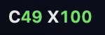

<p align="center">
  
</p>

<h1 align="center">UsageBar</h1>

<p align="center">
  <b>Claude Code + Codex limits in your macOS menu bar.</b><br>
  Never hit the 5‑hour wall by surprise again.
</p>

<p align="center">
  <a href="../../releases/latest"></a>
  <a href="../../releases"></a>
  
  
  <a href="LICENSE"></a>
</p>

<p align="center">
  
</p>

## Why

Claude Code's 5‑hour and weekly windows are invisible until you slam into them mid‑task. `/usage` works, but you have to remember to run it. UsageBar keeps both limits — for **Claude Code** and **Codex** — one glance away, and warns you before you run dry.

## Pick your menu bar style

| Two‑line pill *(default)* | Compact text | Gauge rings |
|:---:|:---:|:---:|
|  |  |  |
| Big and readable, dark pill on any wallpaper | One line, plus a reset countdown when you're nearly out | Minimal — ring = % left, letter = provider |

Green under 60 % used, yellow to 80 %, red beyond.

## Features

- **Zero setup.** If you use the Claude desktop app, it just works — no login, no API token.
- **Two providers.** Claude Code and Codex, each with 5‑hour/session and weekly windows. Hide either one.
- **Notifications** at 80 % and 95 %, and when a window resets ("You're back to 100 %").
- **24h sparkline** of your Claude usage.
- **Reset countdowns** in the dropdown, and in the menu bar when a window is ≥ 80 % used.
- **Remaining or used** — your choice.
- Click any row to open the provider's usage page.
- Launch at login, auto‑refresh (10 s → 5 min), single ~300 KB native Swift binary. No Python, no Electron.

## Install

```bash
brew install idark7/tap/usagebar
```

or grab the DMG from [Releases](../../releases/latest) and drag to Applications.

> **First launch:** the app isn't notarized yet, so macOS will say it "can't be opened".
> Right‑click **UsageBar.app → Open** once (or allow it in *System Settings → Privacy & Security*). Homebrew handles this for you.

Build from source (Xcode command line tools):

```bash
./build.sh   # → build/UsageBar.app and build/UsageBar-<version>.dmg
```

## How it detects usage

| Provider | Source | Needs |
|---|---|---|
| Claude | `~/Library/Application Support/Claude/plan-usage-history.json` — sampled every ~15 min by the Claude desktop app | Claude app installed and signed in |
| Claude | `claude_feed.json` written by the optional Claude Code status‑line hook (adds exact reset times) | see below |
| Claude | `api.anthropic.com/api/oauth/usage` with the Claude Code OAuth token | fallback only |
| Codex | `rate_limits` entries in `~/.codex/sessions/**/*.jsonl` | Codex CLI |

Whichever local source is freshest wins. When only the desktop‑app sample is available, the 5‑hour reset time is estimated from when the window started (shown as "≈"). Nothing leaves your machine.

<details>
<summary><b>Optional: exact reset times from Claude Code</b></summary>

Add the status line hook to `~/.claude/settings.json`:

```json
"statusLine": {
  "type": "command",
  "command": "/usr/bin/python3 \"/path/to/UsageBar/usagebar_statusline.py\""
}
```

It also gives you an `Opus | 5h 11% | wk 26% | project` status line in the terminal.
</details>

## Roadmap

- [ ] Notarized builds
- [ ] More providers — Gemini CLI, Cursor ([vote or request](../../issues))
- [ ] Exact reset times from the Claude desktop app

## Releasing

Tag `vX.Y.Z` and push; GitHub Actions builds a universal DMG and attaches it to the release.
Add `MACOS_CERT_P12`, `MACOS_CERT_PASSWORD`, `MACOS_SIGN_ID`, `APPLE_ID`, `APPLE_TEAM_ID`, `APPLE_APP_PASSWORD` secrets for Developer ID signing + notarization. `UsageBar --snapshot out.png` renders the dropdown for docs.

## License

MIT — [Sudipta Banerjee](https://github.com/idark7)
