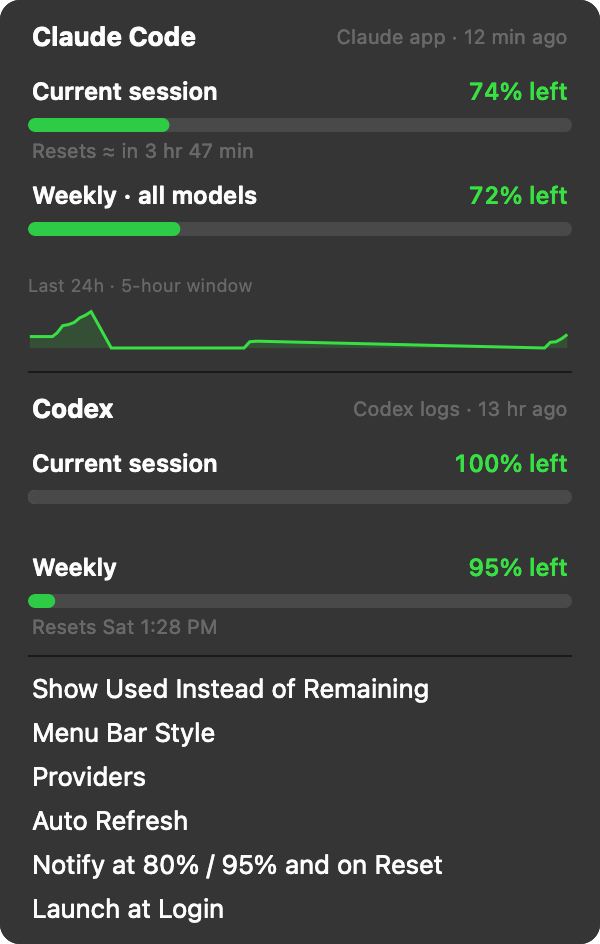

# UsageBar

**Claude Code + Codex limits in your macOS menu bar. Never hit the 5‑hour wall by surprise again.**

<p align="center"></p>

- Live 5‑hour and weekly usage for **Claude Code** and **Codex**, colour‑coded green / yellow / red
- **Zero setup** — if you use the Claude desktop app, it just works. No login, no API token.
- Native **notifications** at 80 % and 95 %, and when a window resets
- **24h sparkline** of your Claude usage
- Three menu bar styles: two‑line pill, compact `C89 X100`, or gauge rings
- Countdown to reset in the menu bar when you're nearly out
- Show % remaining (default) or % used
- Click a row to open the provider's usage page
- Launch at login, configurable auto‑refresh, single native Swift binary (no Python, no Electron)

## Install

```bash
brew install idark7/tap/usagebar
```

or download the latest `UsageBar-x.y.z.dmg` from [Releases](../../releases), drag to Applications.

> Until the app is notarized, macOS will say it "can't be opened". Right‑click the app → **Open** once, or
> allow it under *System Settings → Privacy & Security*.

Or build it yourself (needs Xcode command line tools):

```bash
./build.sh            # → build/UsageBar.app and build/UsageBar-<version>.dmg
```

## How it detects usage

| Provider | Source | Needs |
|---|---|---|
| Claude | `~/Library/Application Support/Claude/plan-usage-history.json`, sampled every ~15 min by the Claude desktop app | Claude app installed and signed in |
| Claude | `claude_feed.json` written by the optional Claude Code status line hook (adds exact reset times) | see below |
| Claude | `api.anthropic.com/api/oauth/usage` with the Claude Code OAuth token | fallback only |
| Codex | `rate_limits` entries in `~/.codex/sessions/**/*.jsonl` | Codex CLI |

Whichever local source is freshest wins. When only the desktop‑app sample is available, the 5‑hour reset time is
estimated from when the window started (shown as "≈").

### Optional: exact reset times from Claude Code

Add the status line hook to `~/.claude/settings.json`:

```json
"statusLine": {
  "type": "command",
  "command": "/usr/bin/python3 \"/path/to/UsageBar/usagebar_statusline.py\""
}
```

It also gives you a `Opus | 5h 11% | wk 26% | project` status line in the terminal.

## Releasing

Tag `vX.Y.Z` and push; the GitHub Action builds a universal DMG and attaches it to the release.
`UsageBar --snapshot out.png` renders the dropdown for docs. Add `MACOS_CERT_P12`, `MACOS_CERT_PASSWORD`, `MACOS_SIGN_ID`, `APPLE_ID`, `APPLE_TEAM_ID`,
`APPLE_APP_PASSWORD` secrets to get Developer ID signing + notarization.

## License

MIT
